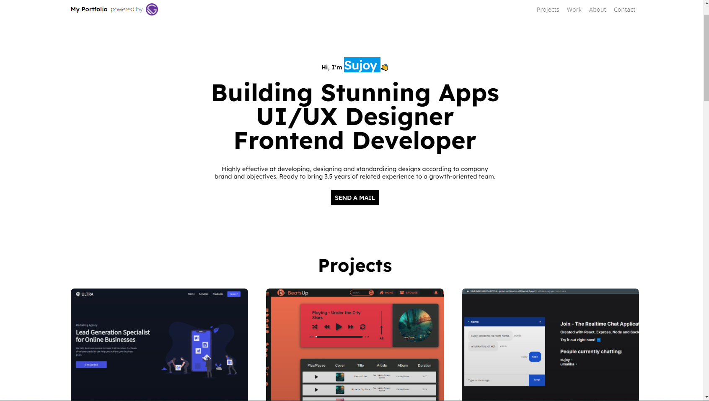

# Gatsby-portfolio

A smooth scroll minimalistic dev portfolio built with Gatsby.js used Yarn to manage the packages  that includes react-helmet for managing SEO, for animation I used react-reveal and react-scroll, SASS for stylling, a bunch of Gatsby plugins.

# Preview

[Click here to see the live demo](https://project-manager-7accb.web.app/)
